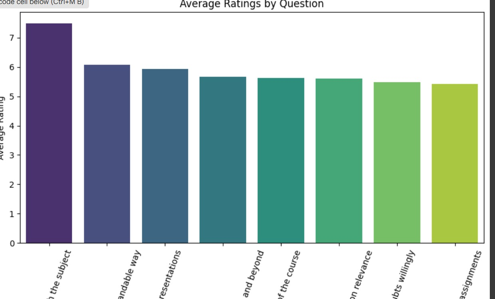
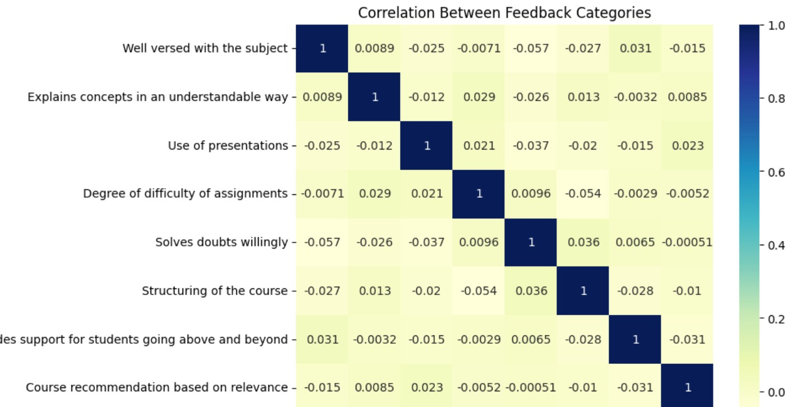

# FUTURE_DS-01
Task 1 - Business Sales Dashboard ( Future Interns Data Science &amp; Analytics Internship )
# Task 1: E-Commerce Sales Analysis Dashboard

## 📌 Objective
Analyze e-commerce sales data to identify:
- Best-selling products
- Sales trends over time
- High-revenue categories


## 🛠️ Tools & Technologies
- **Power BI**: For data visualization and dashboard creation  
- **DAX (Data Analysis Expressions)**: For calculated measures and KPIs  
- **Excel/CSV**: Raw dataset provided for analysis  

---

## 🔍 Process Overview
1. **Data Cleaning**: 
   - Removed null values and duplicates
   - Standardized column names and data types

2. **Data Transformation**: 
   - Created calculated columns and measures using DAX
   - Added date hierarchy for trend analysis

3. **Visualization & Insights**: 
   - Designed an interactive Power BI dashboard
   - Added slicers and filters for dynamic analysis


## 📈 Key Insights
- Identified **top-performing products** by revenue and quantity
- Detected **peak sales months and trends** for inventory planning
- Highlighted **high-revenue product categories**


## 📂 Deliverables
- **Dashboard.pbix**: Interactive Power BI dashboard
- **Task1_Report.pdf**: Summary of findings and dashboard snapshots
- **Dataset.csv**: Cleaned dataset (if permitted to share)


## 🚀 Skills Gained
- Data cleaning & preprocessing  
- Writing DAX measures for KPIs  
- Trend analysis & data-driven storytelling  
- Dashboard design in Power BI  


 📊 *Dashboard Preview:*  


---

## ✅ Task 2: Marketing Campaign Insight Analysis  
*Objective:* Evaluate the effectiveness of marketing campaigns and customer spending patterns.  

*Key Insights:*  
1. *Accepted Campaigns* – Campaign 2 & 4 had the highest acceptance (~25% each).  
2. *Purchases* – Store purchases dominate (39%), followed by web & catalog.  
3. *Spending by Education* – Graduates are the biggest spenders, especially on *wines & meat products*.  
4. *Income vs Spending* – Strong positive correlation: higher income = higher spending.  
5. *Trends* – Income peaked in *Q1 2013*, but complaints increased, leading to reduced spending later.  

📊 *Dashboard Preview:*  


# 🎓 Student Feedback Analysis

This project is part of my **Data Science & Analytics Internship Task 3**.  
The goal is to analyze student feedback collected after college events/courses and identify strengths and areas for improvement.

---

## 📂 Files in this Repository
- **student_feedback.csv** → Raw dataset (ratings from students)  
- **student_feedback_analysis.ipynb** → Jupyter/Colab Notebook with data cleaning, analysis, and visualizations  
- *(This README file)* → Explanation and summary  

---

## 📊 Key Insights
- ✅ **Highest rated aspect:** *Explains concepts in an understandable way* (avg ≈ X.X)  
- ⚠️ **Lowest rated aspect:** *Degree of difficulty of assignments* (avg ≈ 5.4)  
- 📌 **Overall average satisfaction:** ≈ X.X / 10  
- 🔎 Correlation analysis shows that students rated each aspect independently (low correlation values).  

---

## 📈 Visualizations
The notebook includes:
- Bar chart → Average rating per feedback category  
- Heatmap → Correlation between feedback questions  
- Distribution plots → Spread of ratings for each question  

---

## 🛠 Tools & Libraries
- **Python** (Pandas, Matplotlib, Seaborn)  
- **Google Colab** for running the notebook  

---

## 📌 Recommendations
- Continue focusing on **subject knowledge and clarity of explanations** (students rated these highly).  
- Work on **structuring of the course** and reducing the **difficulty of assignments** to improve student satisfaction.  
- Collect **open-text feedback** in future surveys for deeper insights (e.g., word cloud, sentiment analysis).  

---

✍️ *Prepared as part of Future Interns – Data Science & Analytics Internship*
```
### Bar Chart of Average Ratings


### Correlation Heatmap



